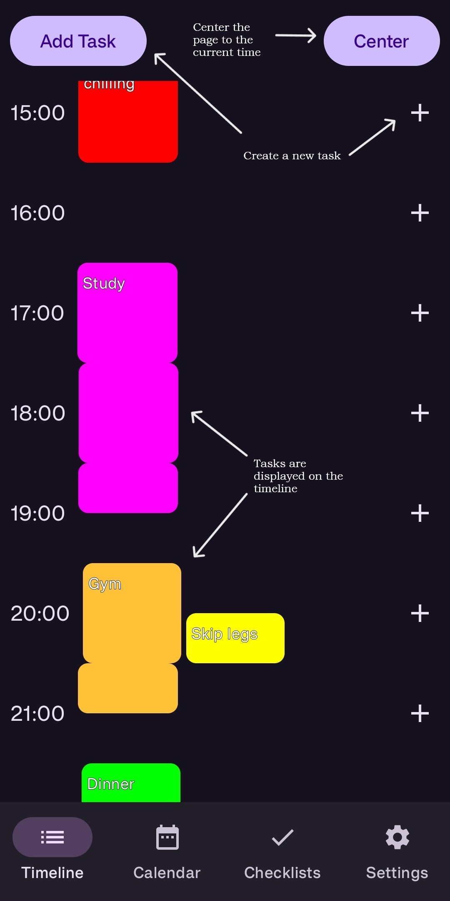
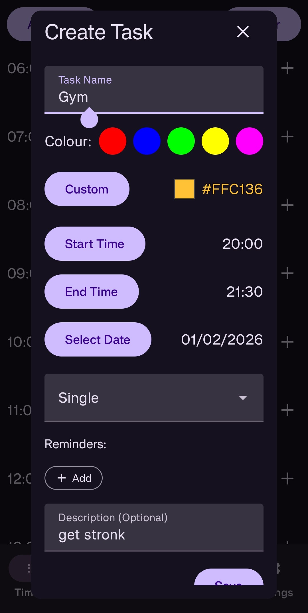
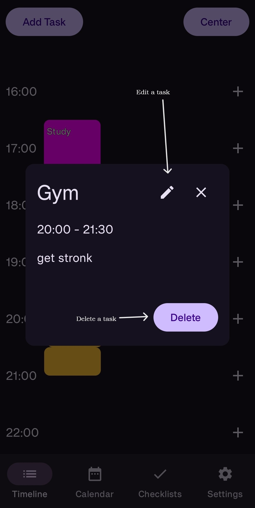
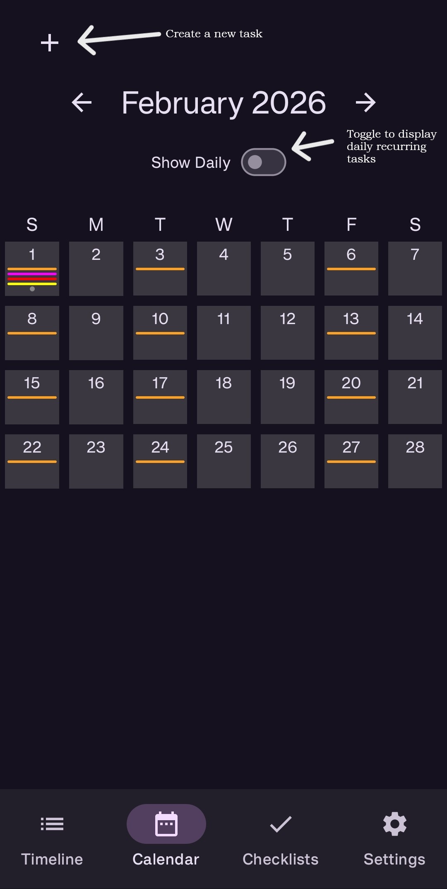
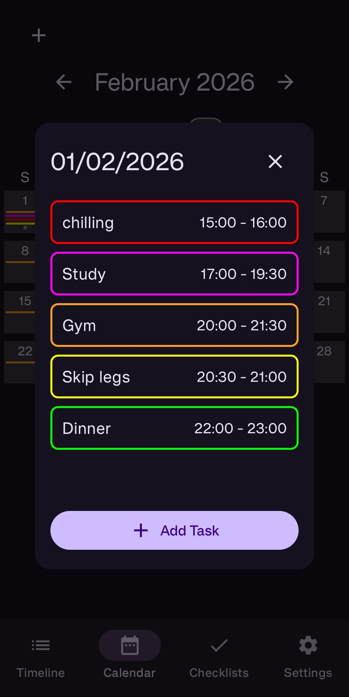
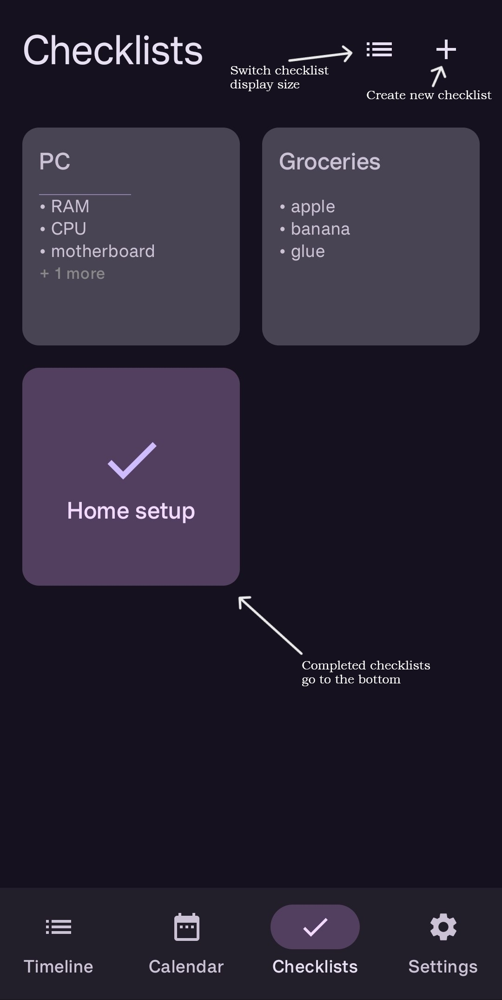
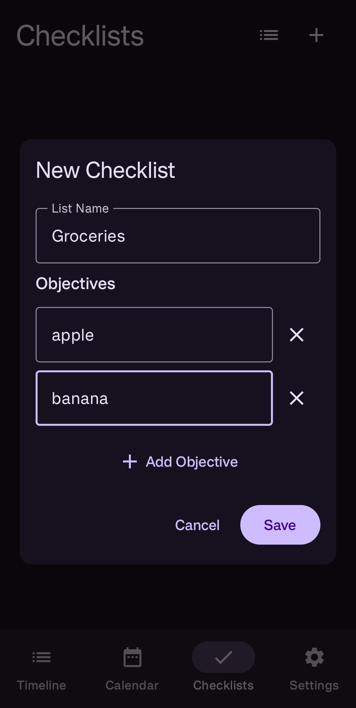
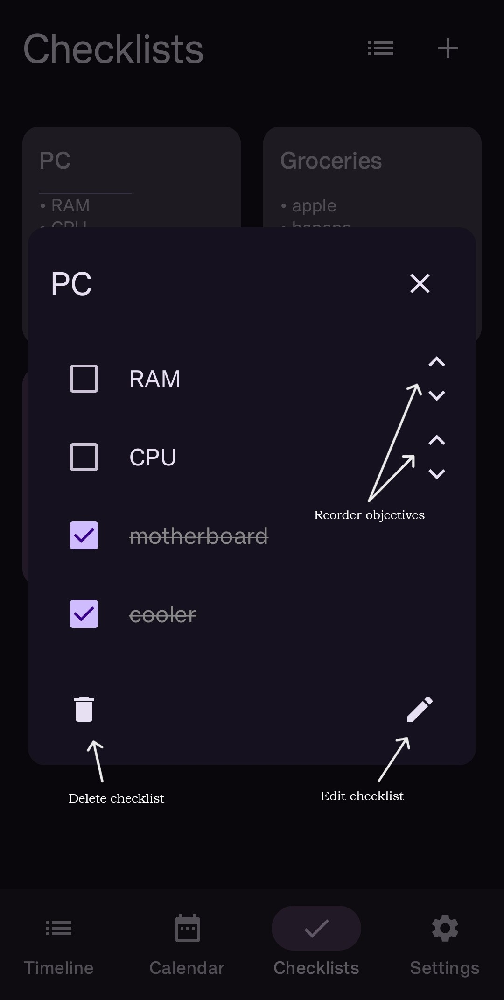
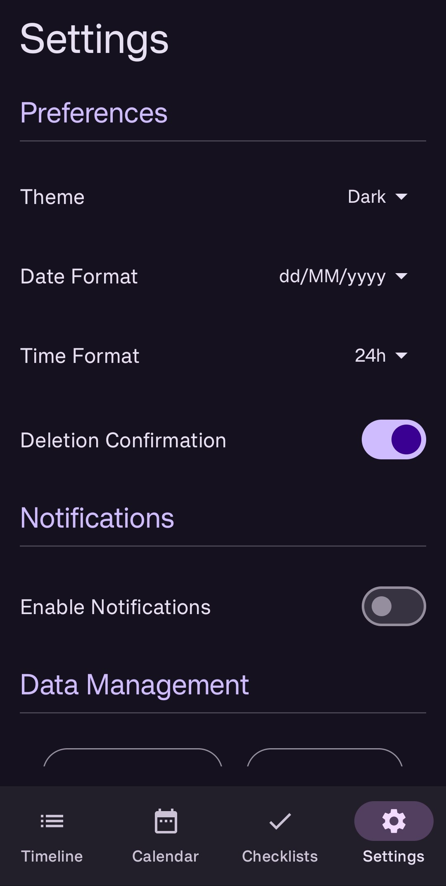

# LockInPlanner Application

LockInPlanner is a simple app to plan your day. You can create/update/delete tasks, set up recurring tasks, view the current day's tasks or all the tasks through a calendar. It is a simple application I created for myself to, well, lock in (I am more locked out than ever).

**NOTICE : 100% of the code is generated using AI, specifically Google's Antigravity tool. I don't know a lick of Kotlin. I did guide the development process and gave comprehensive design details. I also ran tests (through Android studio), and suggested optimization methods for the LLM to implement.**

## Features
* **Tasks** can be created from various places, and are displayed on a timeline showing the hours of the present day. These tasks are also displayed on the calendar page, allowing you to see tasks for any given date. Tasks have the following attributes: Name, Colour, Start Time, End Time, Date, Repeatability, Description.
<p align="center">
  
  <br>
  <em>Timeline Appearance</em>
</p>
<p align="center">
  
  <br>
  <em>Task Creation</em>
</p>
<p align="center">
  
  <br>
  <em>Task View</em>
</p>
<p align="center">
  
  <br>
  <em>Calendar</em>
</p>
<p align="center">
  
  <br>
  <em>Calendar Day View</em>
</p>

* **Checklists** are simple lists that contain objectives that can be completed.
<p align="center">
  
  <br>
  <em>Checklists</em>
</p>
<p align="center">
  
  <br>
  <em>Checklist Creation</em>
</p>
<p align="center">
  
  <br>
  <em>Checklist View</em>
</p>

* **Customisation** options are available in the settings.
<p align="center">
  
  <br>
  <em>Preferences</em>
</p>

## Installation

Latest version is `v1.0`.

### Option 1: Download APK (Easiest)
You can simply download and install the latest version of the app directly on your Android device.

1.  Go to the [Releases](https://github.com/epikadith/LockInPlanner/releases) section of this repository.
2.  Download the **APK** file (e.g., `LockInPlanner-v1.0.apk`) from the latest release.
3.  Open the file on your Android phone and click **Install**.
    *   *Note: You may need to allow "Install from Unknown Sources" in your browser settings if this is your first time sideloading an app.*

### Option 2: Build from Source
If you are a developer and want to modify the code or build it yourself:

1.  **Clone the repository**:
    ```bash
    git clone https://github.com/epikadith/LockInPlanner.git
    ```
2.  **Open in Android Studio**:
    *   Launch Android Studio -> File -> Open -> Select the cloned folder.
    *   Wait for Gradle to sync (this downloads necessary dependencies).
3.  **Run the App**:
    *   Connect your Android device (ensure USB Debugging is on) or create an Emulator.
    *   Click the green **Run** (Play) button in the top toolbar.
    *   *Alternatively, run `./gradlew assembleDebug` in the terminal to build an APK.*

## Built With

*   [Kotlin](https://kotlinlang.org/) - First-class language for Android development
*   [Jetpack Compose](https://developer.android.com/jetpack/compose) - Modern toolkit for building native UI
*   [Room](https://developer.android.com/training/data-storage/room) - SQLite abstraction library
*   [Gson](https://github.com/google/gson) - Java serialization/deserialization library to convert Java Objects into JSON and back
*   [ColorPicker Compose](https://github.com/skydoves/colorpicker-compose) - A color picker for Jetpack Compose by skydoves

## License

This project is licensed under the MIT License - see the [LICENSE](LICENSE) file for details.

### Third Party Licenses
This application makes use of the following third-party libraries:

*   **ColorPicker Compose** by skydoves (Apache License 2.0)
*   **Gson** by Google (Apache License 2.0)
*   **Android Jetpack** (Apache License 2.0)